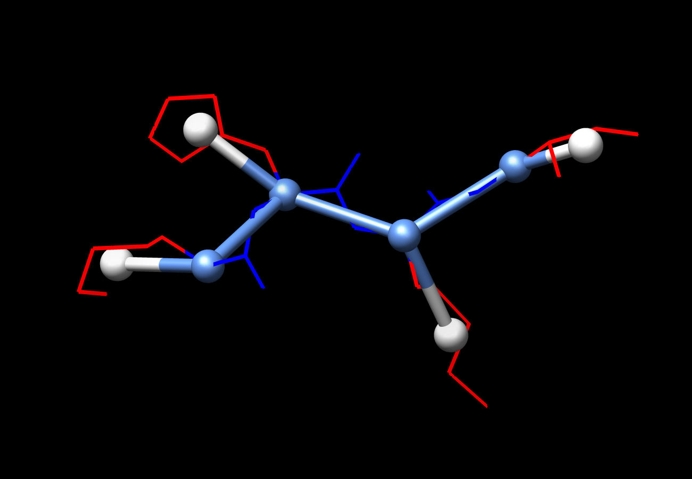
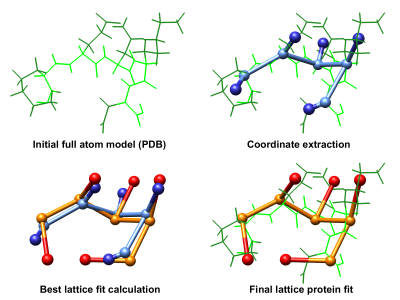

# LatPack

Collection of tools related to modelling and folding simulations of lattice-protein models with arbitrary energy functions

Available tools:

    	
-    [LatFit - Fitting of a real PDB protein structure onto a lattice](#latfit---pdb-fitting-for-3d-side-chain-lattice-protein-models)
-    LatFold - Global folding simulation using Pull-moves or Pivot-moves
-    LatVec - Sequential/Co-tranlational folding simulation
-    LatConv - Conversion between structure representations (including PDB format)
-    LatNum - Counting the number of possible non-symmetric structures
-    LatMap - Compare different structure via cRMSD/dRMSD/GDT


## Main Publication

- Martin Mann, Daniel Maticzka, Rhodri Saunders, and Rolf Backofen.
	**[Classifying protein-like sequences in arbitrary lattice protein models using LatPack](https://doi.org/10.2976/1.3027681)**.
	In HFSP Journal, 2 no. 6 pp. 396, 2008.
	Special issue on protein folding: experimental and theoretical approaches.
	[DOI:10.2976/1.3027681](https://doi.org/10.2976/1.3027681).
	Supplementary data can be obtained [HERE](pub-data). 

## Documentation

A pdf documentation for each tool is generated in the `doc` subfolder of the package (pdflatex required).

-    [LatSeF manual](doc/manual-LatVec.pdf)
-    [LatFold manual](doc/manual-LatFold.pdf)
-    [LatFit manual](doc/manual-LatFit.pdf)


## Dependencies

- the Bioinformatic Utility library - BIU (**INCLUDED**)
- the Energy Landscape Library - ELL (**for LatFold only - when resp. configure flag `--enable-latfold' is set**)


## Compilation

When downloading the sources directly from or via cloning the repository, you need to first initialize the configure script.
To simply, we provide a simple bash script:

```
bash initialize_configure.sh
```

Afterwards (or when downloading the source tar-ball), you can check the `configure` options.

```
# check configure options
./configure --help

# run configure
./configure
# compile binaries
make
```

If compilation went fine, the binaries will be available within the `src` folder. 

You can install the binaries to your system via

```
# install to default directory, to be changed via "./configure --prefix=XXX"
make install 

# install to specified directory
make install prefix=XXX
```


---------------------------------------------------------

# LatFit - PDB fitting for 3D side chain lattice protein models 



LatFit allows for the creation of high resolution models of full atom protein structures in lattice models.
It enables the fitting of backbone and side chain models of a given protein in PDB format. 
The applied method is sketched in the following. 


## Procedure




We follow a chain elongation procedure similar to that described by Park and Levitt (JMB,1995). Residues are placed on the lattice sequentially starting from the amino terminus, for each residue placement the current best lattice fit is iteratively extended. Each extension is evaluated via RMSD, and the best fit further extended until full chain length is achieved.

The coordinates fitted are user defined. By default LatFit takes the C_alpha atom coordinates for the backbone and the centre of mass of non-hydrogen side chain atoms as the side chain. A cartoon of the LatFit workflow is given on the right (click for larger version).

For details about the method applied and its parameters see the [LatFit manual](doc/manual-LatFit.pdf). 


